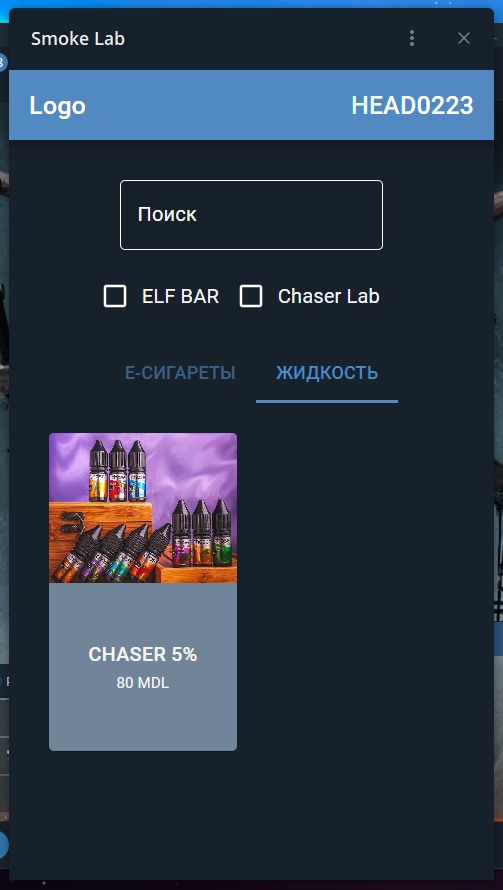
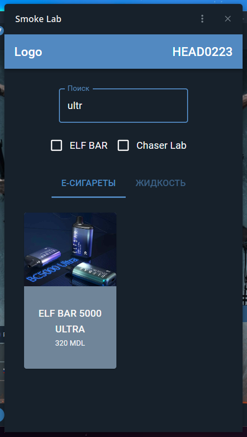

# Smoke Lab (**Client**)


This React-based web application, integrated with Material-UI, provides a streamlined experience for managing the Smoke Lab store. Tailored to match the aesthetic of the Smoke Lab Telegram theme, the application offers a comprehensive set of features. Users can effortlessly explore the catalog with a list of available items, leverage powerful filters and search functionality, add items to their cart, and seamlessly create orders. The application prioritizes user convenience, making the Smoke Lab store management intuitive and efficient.

## Table of Contents

-  [Folder Structure](#folder-structure)
-  [Usage](#usage)
-  [Media](#media)
-  [Localization](#localization)
-  [Contributing](#contributing)
-  [Dependencies](#dependencies)

## Folder Structure

-  **public:** Contains public assets and the main HTML file.
-  **src:**
   -  **components:** Reusable components.
   -  **hooks:** Custom React hooks for managing state and logic in functional components.
   -  **redux:** Redux store setup and slices.
   -  **App.js:** Main component rendering routes and managing state.
   -  **index.js:** Entry point of the application.
   -  **axios.js:** Configuration for Axios HTTP client.

## Usage

1. Clone the repository:

```bash
git clone https://github.com/HEAD0223/smoke-lab-web.git
cd smoke-lab-web
```

2. Install dependencies:

```bash
npm install --force
```

3. Start the development server:

```bash
npm start
```

4. Visit `http://localhost:3000` in your browser to see the application.

## Media

### Mobile


### PC


**List with items:**





**Item with flavor selection, and quantity:**


**Cart with user purchase and form for contact:**


**Order in user profile in Telegram bot and email for admins with user purchase and credentials:**


## Localization

The application supports localization using i18n. Translation files are located in the `public/assets/locales` directory. Add new translations as needed.

## Contributing

If you would like to contribute to this project, please follow these steps:

1. Fork the repository.
2. Create a new branch for your feature: `git checkout -b feature-name`
3. Commit your changes: `git commit -m 'Add some feature'`
4. Push to the branch: `git push origin feature-name`
5. Submit a pull request.

## Dependencies

-  **React:** JavaScript library for building user interfaces.
-  **Material-UI:** React UI framework for building responsive and accessible web applications.
-  **Redux Toolkit:** State management library for React applications.
-  **React Router:** Declarative routing for React.js.
-  **i18next:** Internationalization library for handling translations.
-  **axios:** Promise-based HTTP client for the browser and Node.js.
-  **js-cookie:** A simple, lightweight JavaScript API for handling cookies.

Make sure to include these dependencies in your project.
